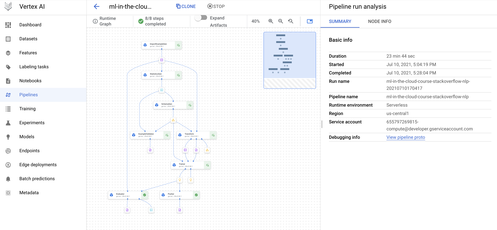

# Vertex Custom Training with Natural Language dataset (classification)

There are three types of resources to train cusom models ion vertex AI:
1. Training pipelines
2. Custom jobs
3. Hyperparameter tuning jobs

## Training pipelines

Resource to orchestrate a training pipeline that adds additional steps beyond training, such as:
* loading a dataset 
* uploading the resulting model to Vertex AI after the training job is successfully completed.

Training pipelines are implemented through the `aiplatform.CustomTrainingJob` class.

You can implement distributed strategies for training using this class.

## Custom jobs

Resource to train an ML model. 
You must specify:
* Training code
* Dependencies

Custom job are implemented through the `aiplatform.CustomJob` class.

## Hyperparameter tuning jobs

Resource to implement hyperparameter tuning in a job. Based on a CustomJob, but has additional settings to configure, such as the metric.

Hyperparameter tuning job are implemented through the `aiplatform.HyperparameterTuningJob` class.

Note that the HyperparameterTuningJob class **do not accept** a CustomTrainingJob instance.

You can combine distributed training with hyperparameter tuning.

# TFX pipeline 

This code is an alternative demo to the Taxi pipeline tutorial (structured data):
* Uses a different dataset:
    * Unstructured data (not tabular)
    * Text classification
* Uses TFX and Vertex Pipelines
* TODO: Will offload to Vertex Training and Prediction managed services
* TODO: Will show other MLOps managed features

## Dataset

This demo is an alternative demo to the Taxi pipeline tutorial (structured data):
* Uses a different dataset:
    * Unstructured data (not tabular)
    * Text classification

Use the tool `txt2tfrecord` to convert original dataset at https://storage.googleapis.com/download.tensorflow.org/data/stack_overflow_16k.tar.gz into TFrecord format.

## Resources

[1] Codelab with MultiWorkerMirroredStrategy: https://codelabs.developers.google.com/vertex_multiworker_training#6